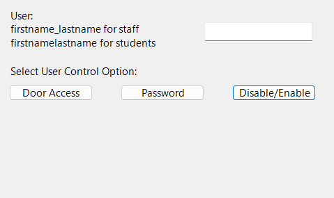

# Simple Gui for adding user to AD Security Groups.

This PowerShell script is a simple WinForm gui app that allows the user to assign or remove AD group membership to a specified user. In this specific example, we use it to select the user, their building label, and access tier so they can be assigned building access via AD.

## Functions

### AddOrRemoveUserFromGroup

This function adds or removes a user from a security group for a specified building and tier.

Within we call several Parameters,  `$group = "SG-$building-D-Tier-$tier"`. For our example, All of the security groups we will be referencing only have 2 variables that change, and we are able to define them in the Form Controls section of the code later on. This makes it easier for the end user to select the desired groups without having to know the full name of any of your security groups. 

#### Parameters

- `$user`: The username of the user to add or remove from the security group. 
- `$building`: The name of the security building to which access is being assigned or removed. 
- `$tier`: The security tier to which access is being assigned or removed. 
- `$removeAccess`: A boolean value indicating whether access is being granted or removed. If this parameter is set to `$true`, the user will be removed from the security group. If it is set to `$false`, the user will be added to the security group. This parameter is optional.

Adjust the `$building` `tier` and `$group` variables to suite your use case.
### TierDefButton_Click

This function displays a popup window with the security tier definitions.

### AddUserButton_Click

This function handles the "Add User" button click and calls the `AddOrRemoveUserFromGroup` function.

### GetGroupsButton_Click

This function displays a list of the groups associated with the specified user.

## Form Controls

The following form controls are used in this script:

- `$userLabel`: A label indicating where to enter the user's username.
- `$userTextBox`: A text box for entering the user's username.
- `$buildingLabel`: A label indicating where to select the building.
- `$buildingComboBox`: A dropdown list for selecting the building.
- `$tierLabel`: A label indicating where to select the security tier.
- `$tierComboBox`: A dropdown list for selecting the security tier.
- `$addButton`: A button for adding or removing the user from the security group.
- `$removeAccessCheckBox`: A checkbox for indicating whether access is being granted or removed.
- `$getGroupsButton`: A button for displaying the groups associated with the specified user.
- `$tierDefButton`: A button for displaying the security tier definitions.

## Usage

To use this script, run it in PowerShell or download the EXE file(TBD) and fill in the required fields.

:::note
You must have the Active Directory PowerShell Module installed to run the script
:::
